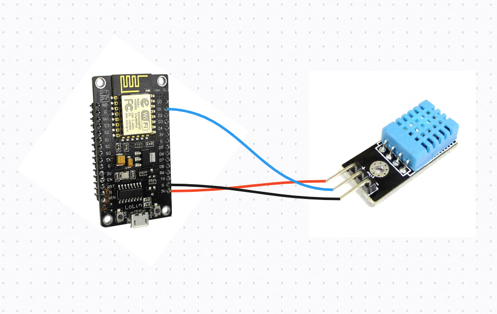
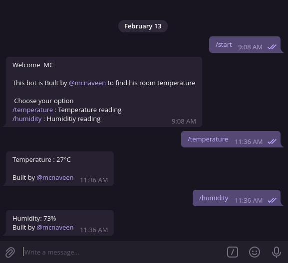

## Room temperature and humidity with ESP8266, DHT11, and a Telegram bot

Read DHT11 values on a NodeMCU and control replies from Telegram using `/` commands. Only the configured chat ID can use the bot.

### Requirements

- ESP8266 NodeMCU
- DHT11 sensor
- Three jumper wires
- USB cable

### Libraries (Arduino IDE)

- **ESP8266 board support** — add this JSON in *File → Preferences → Additional boards manager URLs*, then install the ESP8266 package via *Tools → Board → Boards Manager*:

  `https://arduino.esp8266.com/stable/package_esp8266com_index.json`

- **DHT sensor library** — *Sketch → Include Library → Manage Libraries* → search `DHT sensor library` (Adafruit), install it (pulls in **Adafruit Unified Sensor** if needed).

- **UniversalTelegramBot** — same Library Manager, search `UniversalTelegramBot` and install.

### Wiring



| DHT11 | NodeMCU |
|-------|---------|
| VCC   | 3V3     |
| GND   | GND     |
| DATA  | D1      |

### Configure the sketch

Open `program.cpp` and set:

| Setting | Variable | What to put |
|---------|----------|----------------|
| Wi-Fi name | `ssid` | Your network SSID |
| Wi-Fi password | `password` | Your network password |
| Bot token | `kBotToken` | From [@BotFather](https://t.me/BotFather) (`/newbot` or token for an existing bot) |
| Allowed user | `kTelegramChatId` | Your numeric chat ID (e.g. from [@chatidx_bot](https://t.me/chatidx_bot)) |

Paste the sketch into the Arduino IDE (or open this file as your `.ino` main tab), select the correct **board** and **port**, then upload. Open the **Serial Monitor** at **115200** baud and reset the board; you should see Wi-Fi connect, then Telegram polling in the log when messages arrive.

### Built-in `/` commands

These are handled in firmware for the authorized chat only:

| Command | Description |
|---------|-------------|
| `/start` | Short help and list of commands |
| `/temperature` | Current temperature (°C) |
| `/humidity` | Current relative humidity (%) |
| `/status` | Temperature and humidity together |

Telegram may send commands as `/command` or `/command@YourBotName`; the code accepts both.

### Optional: command menu in Telegram (BotFather)

So users see commands in the chat attachment menu:

1. Open [@BotFather](https://t.me/BotFather), send `/mybots`, choose your bot.
2. Tap **Edit Bot** → **Edit Commands**.
3. Paste a list like (one command per line: `command` — description):

   ```
   start - Show help and command list
   temperature - Get temperature in °C
   humidity - Get humidity in %
   status - Get temperature and humidity
   ```

4. Save. Clients will show these after a refresh; behavior is still defined by your ESP8266 code.

### How to add a new `/` command in code

1. **Pick a name** — use a single word after `/`, e.g. `/uptime`.

2. **Handle it in `handleNewMessages`** — after the existing `commandIs` checks, add a block like:

   ```cpp
   if (commandIs(text, "/uptime")) {
     unsigned long sec = millis() / 1000;
     bot.sendMessage(chatId, "Uptime: " + String(sec) + " s", "");
     continue;
   }
   ```

   Always end with `continue` so you do not fall through to the “Unknown command” reply.

3. **Reuse `commandIs`** — it already supports `/cmd` and `/cmd@BotUsername`. Do not use `text == "/foo"` only, or mobile clients may break.

4. **Update BotFather** (optional) — add the new line under **Edit Commands** so it appears in the menu.

5. **Update `/start` text** — in the `welcome` string inside the `/start` handler, add a line describing the new command so `/start` stays accurate.

### Sample response

Example Telegram reply (your UI may differ):



### Troubleshooting

- **Telegram “status 0” or no API connection** — ensure Wi-Fi has internet access, `kBotToken` is correct, and BearSSL buffer settings in `setup()` stay as in the repo (`setInsecure()` + `setBufferSizes`).

### Contributing

Pull requests for bug fixes or features are welcome.

### License

MIT License
