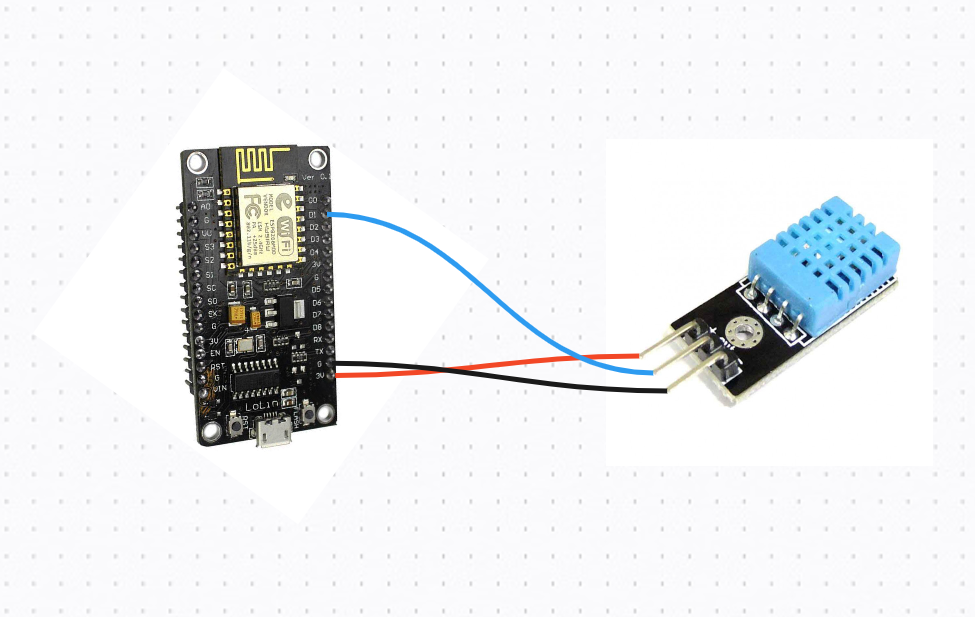

## Get Room Temperature and Humidity using ESP8266, DHT11 and Telegram Bot

### Requirements:
- ESP8266 NodeMCU
- DHT11 Sensor
- Three Jumper Wires
- USB cable

### Connection Diagram:


### Connections:
- Connect `+ (VCC)` to 3V in NodeMCU
- Connect `- (GND)` to GND in NodeMCU
- Connect `OUT (DHT11 data pin)` to D1 in NodeMCU

### Code Instructions:

Open the `program.cpp` file and modify the following lines:

- In **Line 17** Replace `NAME OF WIFI` with your WIFI SSID

- In **Line 18** Replace `PASSWORD OF WIFI` with your WIFI Password

- In **Line 22** Replace `BOT TOKEN` with your Telegram Bot Token (Get Bot Token from BotFather)

- In **Line 50** Replace `CHAT ID` with your Telegram Chat ID (Get Chat ID from here: https://t.me/chatidx_bot)

Once done, Paste the Code into Arduino IDE.

- Make sure that you have added the following libraries:

```
https://arduino.esp8266.com/stable/package_esp8266com_index.json
```

- You also need to add _UniversalTelegramBot_ library.
> Go to Sketch -> Include Library -> Manage Libraries -> Search for `UniversalTelegramBot` and install it.

- Make sure you have selected the correct board in the Arduino IDE.

- Once finalised, upload the code to the ESP8266 NodeMCU, Press the `FLASH` Button if required.

- Then Open the Serial Monitor, Press `RST` Button and wait for the ESP8266 to connect to the WiFi.

- Now start the telegram bot and test it.

### Sample Response:

- Here is the sample response from the ESP8266 in Telegram:


### Pull Request:
- We are looking for any kind of bug fixes or new features.

### License:
- MIT License